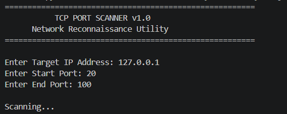
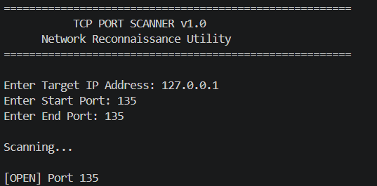
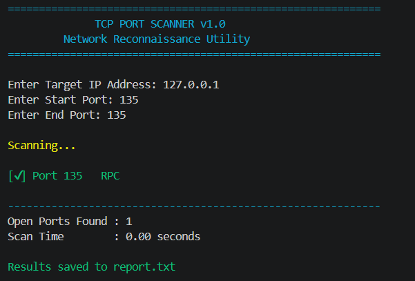
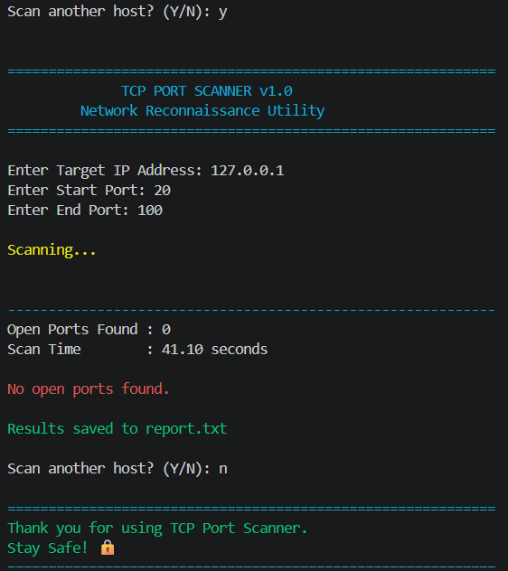

# 🛡️ Network Port Scanner

A Python-based TCP Network Port Scanner developed using Python and Socket Programming. This tool scans a target IP address within a specified port range, identifies open TCP ports, maps common services, and generates a scan report for basic network reconnaissance.

---

## 📌 Features

- Scan any target IPv4 address
- Scan a user-defined range of TCP ports
- Detect open ports using TCP socket connections
- Display common service names (HTTP, SSH, FTP, RPC, etc.)
- Measure total scan time
- Save scan results to `report.txt`
- Color-coded terminal output
- Scan multiple hosts without restarting the application

---

## 🛠️ Technologies Used

- Python 3
- Socket Programming
- Colorama
- Git & GitHub

---

## 📂 Project Structure

```
Network-Port-Scanner/
│
├── src/
│   └── main.py
│
├── screenshots/
│   ├── Scanner_home.png
│   ├── open_port_rpc.png
│   ├── scan_summary.png
│   └── no_open_ports.png
│
├── README.md
├── LICENSE
├── requirements.txt
└── .gitignore
```

---

## 🚀 How to Run

### Clone the repository

```bash
git clone https://github.com/Noorshamaansari03/Network-Port-Scanner.git
```

### Open the project

```bash
cd Network-Port-Scanner
```

### Install dependencies

```bash
pip install -r requirements.txt
```

### Run the application

```bash
python src/main.py
```

---

## 📷 Screenshots

### Home Screen



### Open Port Detection



### Scan Summary



### No Open Ports



---

## 📖 Sample Output

```
==============================================
TCP PORT SCANNER v1.0
Network Reconnaissance Utility
==============================================

Target IP : 127.0.0.1

Scanning...

[✔] Port 135   RPC

----------------------------------------------

Open Ports Found : 1
Scan Time : 0.00 seconds

Results saved to report.txt
```

---

## 🔮 Future Improvements

- Multi-threaded scanning
- UDP Port Scanning
- Banner Grabbing
- Operating System Detection
- Export results to CSV and JSON
- GUI version using Tkinter

---

## 👩‍💻 Author

**Noorshama Ansari**

- GitHub: https://github.com/Noorshamaansari03

---

## ⭐ If you found this project useful, consider giving it a Star.